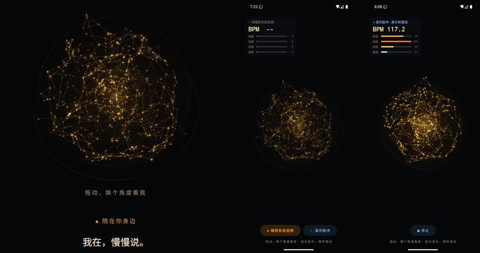
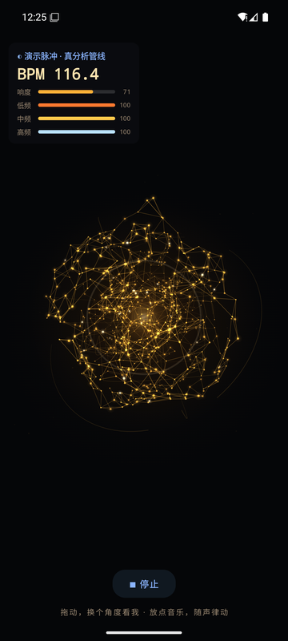

# NeuralPulse · 神经律动

> **本项目是服务于 [Loyea](#关于-loyea) 的测试项目**：把 Loyea 陪伴模式里那颗实时渲染的
> 「Neural Living」神经网模型单拎出来，验证它接上**系统正在播放的声音**后的
> 音频可视化响应能力。它是一个技术试验场，不是独立产品。





## 这是什么

- **模型本体**：`NeuralLivingScene` —— 一颗由 135 个核心节点 + 610 个外壳节点组成的
  神经体积（度上限 5 的近邻边、28 条三锚点桥接路径、2 组直立轨道弧线、30 尘埃、
  36 电火花），逐行移植自 Loyea 陪伴模式的 Neural Living 渲染组件，视觉基因完整保留：
  暖金加性混色、五层呼吸帧、漂移场、电火花沿边游走、可拖拽视角。
- **音频律动**（本项目新增的全部内容）：

  | 音频特征 | 视觉映射 |
  | --- | --- |
  | 响度 RMS（AGC 归一） | 活跃度（静伴→倾听→思考之外再向上）、呼吸/漂移振幅、整体增辉 |
  | 节拍（谱通量自适应阈值） | 时间流瞬时加速、电火花提速、核心冲击波光环、节点半径脉冲 |
  | BPM（拍间隔中位数 + 倍速折叠） | HUD 实时显示 + 整网按小节（4 拍）正弦胀缩 |
  | 低/中/高频段能量 | 色相偏移（低频偏暖红、高频偏亮金）+ HUD 频段条 |
  | 谱重心 | 色相微调的第二输入 |

## 关于 Loyea

NeuralPulse 是 Loyea 的配套测试项目，用于在脱离 Loyea 宿主的独立环境里验证
Neural Living 模型的「音频响应」扩展是否成立，验证通过的经验会反哺 Loyea。
Loyea 本体为私有项目，本仓库只包含移植后的模型与音频管线，不包含 Loyea 的
业务代码与资源。

无音频输入时，场景逐帧行为与 Loyea 原版**完全一致**——所有音频调制都是乘法
增益项，不改变拓扑、种子、层帧定值与漂移场的任何基础常数。

## 三种音源模式

| 模式 | 通路 | 适用 |
| --- | --- | --- |
| **● 捕获系统音频** | MediaProjection 授权 → `AudioPlaybackCapture`（USAGE_MEDIA/GAME/UNKNOWN） | 真机（Android 10+）。系统弹窗里选 **Share entire screen**。抓的是混音后送往扬声器/耳机的输出流（非麦克风），任何在出声的 App 都会被律动捕捉；个别 App 可通过捕获策略拒绝 |
| **🎙 麦克风** | `VOICE_RECOGNITION` 源直采 | 回退通路：真机外放拾音；模拟器上映射到宿主输入设备。内置 -70dB 静音门限，安静环境不放大底噪 |
| **▷ 演示** | 合成 120BPM PCM（底鼓+踩镲+贝斯）→ **同一条 FFT/节拍/BPM 分析链** | 无外部音源时验证整条管线；HUD 的 BPM≈117-120 即分析器的端到端证明 |

本 App 自身不出声、不落盘任何音频；拖动画面可换视角。

## 系统音频从哪来

`AudioPlaybackCapture`（Android 10/API 29+）：用户通过 MediaProjection 授权后，
前台服务（`foregroundServiceType="mediaProjection"`）持有
`AudioPlaybackCaptureConfiguration`（USAGE_MEDIA/GAME/UNKNOWN）建的 `AudioRecord`，
浮点 PCM 48kHz → 2048 点汉宁窗 FFT（50% 重叠）→ 响度/频段/谱通量 → 特征快照
经 volatile 总线（`AudioBus`）进渲染帧，零锁、零重组。

### 模拟器注意（goldfish HAL 限制）

**模拟器上「捕获系统音频」会读到静音**，这是模拟器音频 HAL 的缺口、不是 App 问题：
投影会话正常建立、AudioRecord 正常挂到 `AUDIO_DEVICE_IN_REMOTE_SUBMIX`
（`dumpsys media.audio_flinger` 可证），但 goldfish HAL 不向 submix 的输出侧写入
混音数据，所以播放捕获读到的是数字静音（分析器日志 `rms=0.0`，诊断代码内置）。
真机没有这个问题——录屏 App 带音轨走的就是同一条通路。
在模拟器上验证分析管线请用「▷ 演示」模式：它喂给分析器的是真实合成的 PCM。

## 跑起来

```bash
# Android Studio 直接打开，或：
./gradlew :app:assembleDebug
adb install -r -g app/build/outputs/apk/debug/app-debug.apk
./gradlew :app:testDebugUnitTest   # DSP 核心 JVM 测试（FFT / 节拍→BPM / 静音门限）
```

### 联调工具

```bash
# 生成指定 BPM 的测试节拍曲（底鼓+踩镲+贝斯，纯标准库）
python tools/make_test_beat.py --bpm 120 --seconds 90 --out out/beat120.wav

# 模拟器联调：宿主机起个静态服务，模拟器里用 Chrome 打开
#   http://10.0.2.2:8123/player.html  （10.0.2.2 = 宿主机）
python -m http.server 8123 -d out
```

## 工程结构

```
app/src/main/java/com/eddy/neuralpulse/
├── NeuralLiving.kt        # 神经网场景模型（Loyea 原版 + setAudioDrive 钩子）
├── NeuralLivingCanvas.kt  # Compose 加性混色渲染 + 音频响应绘制（色相/冲击波/增辉）
├── MainActivity.kt        # 授权流、HUD（BPM/响度/频段）、三模式控制
└── audio/
    ├── AudioBus.kt        # 不可变特征快照 + volatile 总线
    ├── AudioProcessor.kt  # DSP 核心：FFT / 频段 AGC / 静音门限 / 节拍 / BPM / 色相
    ├── AudioAnalyzer.kt   # AudioRecord 读取线程（capture 路径）+ FFT 实现
    ├── DemoSignalSource.kt# 120BPM 合成器（与 tools/make_test_beat.py 同配方）
    └── AudioCaptureService.kt  # 前台服务：mediaProjection / microphone 双类型
```

构建链路：Gradle 8.13 / AGP 8.13.2 / Kotlin 1.9.22 / Compose BOM 2024.02.00 / JDK 17。

## Roadmap

- [x] BPM 锁定小节呼吸（检测到节拍后整网按 4 拍正弦胀缩）
- [x] 麦克风回退通路（含静音门限，安静环境不放大底噪）
- [ ] 频谱驱动的边亮度分层（当前边亮度取全局响度）
- [ ] 直通模式下的更慢 AGC 峰值回落（自动曝光感）

## 授权说明

本项目为 Loyea 的内部测试项目，仅供学习与配套测试使用，未附开源许可证。
